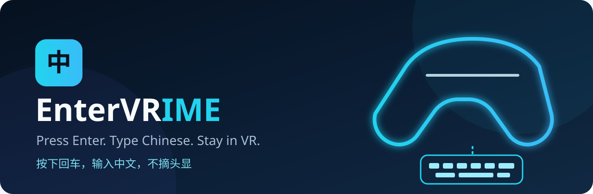
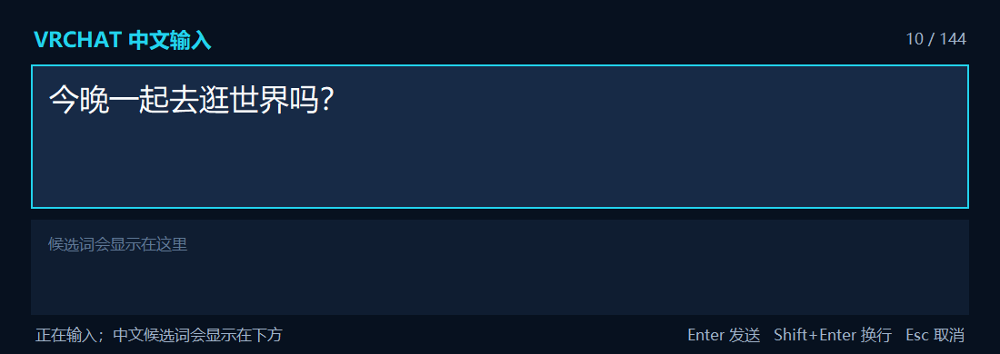
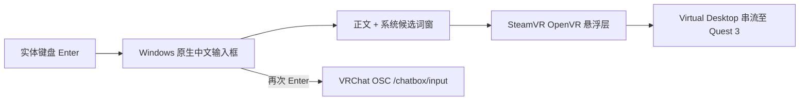

<div align="center">
  
</div>

<div align="center">

[](https://github.com/AsukaNemu/EnterVRIME)
[](https://github.com/AsukaNemu/EnterVRIME)
[](https://www.vrdesktop.net/)
[](https://docs.vrchat.com/docs/osc-as-input-controller)
[](LICENSE)

**按下回车，用你熟悉的中文输入法打字，全程不用摘下头显。**

Quest 3 · Virtual Desktop · SteamVR · VRChat

[快速开始](#快速开始) · [工作原理](#工作原理) · [常见问题](#常见问题) · [English](README.en.md)

</div>

---

EnterVRIME 是一个面向 VRChat PCVR 玩家的轻量 Windows 工具。戴着 Quest 3 时，按下实体键盘的 `Enter` 即可唤出头显内输入面板；微软拼音、搜狗输入法等原生中文输入法的正文与候选词会一起显示在 VR 里，再按一次 `Enter` 便可发送到 VRChat 聊天框。

> 当前版本为早期预览版，专注于 **Virtual Desktop + SteamVR**。VDXR 直连暂不支持。

## 为什么需要它

VRChat 的虚拟键盘适合短句，却不适合中文长文本。摘下头显看显示器会打断沉浸感，而盲打中文又离不开候选词。

EnterVRIME 保留了中文互联网用户已经熟悉的交互：

- 第一次 `Enter`：开始输入；
- 拼音、联想、词频和候选顺序：继续使用你电脑里的原生输入法；
- 输入法候选词：直接显示在 Quest 3 视野内；
- 第二次 `Enter`：发送；
- `Esc`：取消，`Shift + Enter`：换行。

<div align="center">
  
</div>

## 功能亮点

- **不改变输入习惯**：复用 Windows 原生中文输入法和个人词频。
- **候选词真正可见**：捕获输入区域与系统候选窗，显示为头显内悬浮层。
- **一键进入、一键发送**：仅当 VRChat 位于前台时，回车才会唤出输入；确认候选后再次回车发送。
- **沉浸式显示**：面板固定在视野下方，不遮挡主要游戏画面。
- **本地优先**：文本只通过本机 UDP 发往 VRChat OSC，不经过云端服务器。
- **开箱即用**：Release 提供免安装 Windows 便携包。

## 快速开始

### 1. 准备运行环境

- Windows 10 或 Windows 11；
- Quest 3 通过 Virtual Desktop 连接电脑；
- Virtual Desktop 使用 SteamVR 运行 VRChat；
- 在 VRChat 快捷菜单中启用 OSC。

### 2. 下载并启动

从 [Releases](../../releases) 下载最新的 `EnterVRIME-*-win-x64.zip`，解压后双击其中的 `EnterVRIME.exe`。首次运行若 Windows SmartScreen 提示未知发布者，请检查下载来源后选择“仍要运行”。当前预览版尚未使用商业代码签名证书。

状态窗口显示“SteamVR 已连接”后，可将它隐藏到系统托盘。

### 3. 戴上头显输入

| 按键 | 行为 |
| --- | --- |
| `Enter` | 唤出输入面板；候选词确认后再次按下可发送 |
| `Shift + Enter` | 换行 |
| `Esc` | 取消本次输入 |

VRChat 聊天框当前最多支持 144 个字符和 9 行文本。

## 工作原理



程序不会自行实现一套拼音引擎，而是让 Windows 输入法继续负责组词和候选排序，再将屏幕上的输入区域实时提交给 SteamVR 悬浮层。最终文本通过 VRChat 官方 OSC Chatbox 接口发送。

更详细的技术说明见 [架构文档](docs/ARCHITECTURE.md)。

## 外部测试与诊断

让朋友测试时，不需要靠截图猜问题。EnterVRIME 会为每次运行生成本地会话日志，并在状态窗口和系统托盘提供“导出诊断包”。

- 日志目录：`%LOCALAPPDATA%\EnterVRIME\logs`；
- 诊断 ZIP：包含运行环境、SteamVR/热键/捕获/OSC 状态和最近日志；
- 隐私保护：不记录聊天正文、拼音组合内容或候选词；导出时会隐藏用户目录和 Windows 用户名；
- 启动即退出时：使用 Release 中的 `EnterVRIME-Debug-*-win-x64.zip`，控制台会保留更多现场信息。

报错时请让测试者提供屏幕上的错误编号和诊断 ZIP。错误编号按区域分组：`E1xx` 启动/配置、`E2xx` 热键、`E3xx` SteamVR/悬浮层、`E4xx` 画面捕获、`E5xx` OSC、`E9xx` 未处理异常或崩溃。

状态窗口会直接检查 VRChat 是否真的监听 OSC 端口。出现 `E505` 时，请打开 VRChat 的 `操作菜单 → OSC → OSC Debug`；看到“OSC：VRChat 已监听”后，保留的文字即可再次按回车发送。

回车热键采用前台白名单：只有 `VRChat.exe` 是当前前台窗口时才注册。切换到浏览器、启动器或桌面后会立即注销，不会吞掉回车或抢走焦点。

## 兼容性

| 组件 | 当前状态 |
| --- | --- |
| Quest 3 + Virtual Desktop + SteamVR | 主要支持目标 |
| Windows 10 / 11 | 支持 |
| 微软拼音、搜狗等 Windows 输入法 | 通过原生文本框兼容 |
| VRChat PCVR + OSC | 支持 |
| Virtual Desktop 的 VDXR 直连 | 暂不支持 |
| Quest 版 VRChat 独立运行 | 暂不支持 |

## 常见问题

<details>
<summary><strong>头显里没有出现输入面板</strong></summary>

确认 Virtual Desktop 当前使用 SteamVR，而不是 VDXR；随后从 SteamVR 启动 VRChat。桌面状态窗口应显示“SteamVR 已连接”。

</details>

<details>
<summary><strong>能看到输入内容，但发送后 VRChat 没反应</strong></summary>

请在 VRChat 快捷菜单中启用 OSC，并确认没有其他软件占用默认 UDP 端口 `9000`。

如果状态窗口显示 `E505`，请打开 VRChat 的 `操作菜单 → OSC → OSC Debug` 页面。打开该页面也会强制启用 OSC；等待 EnterVRIME 显示“OSC：VRChat 已监听”后再发送。

</details>

<details>
<summary><strong>按回车后没有弹出输入框</strong></summary>

另一个程序可能抢占了全局回车热键。退出冲突程序后，从托盘重新启动 EnterVRIME。

</details>

<details>
<summary><strong>为什么不直接支持 VDXR？</strong></summary>

本项目使用 SteamVR 的 OpenVR Overlay API 将二维面板叠加到任意 VR 场景。VDXR 是另一条 OpenXR 运行时路径，第三方悬浮层机制不同，后续需要单独适配。

</details>

## 路线图

- [ ] 在不同分辨率、DPI 与多显示器环境中扩大实机覆盖；
- [ ] 可视化调整面板距离、高度、大小和透明度；
- [ ] 自动检测 VRChat OSC 状态并提供连接测试；
- [ ] 自定义唤出热键与游戏白名单；
- [ ] 研究 VDXR / OpenXR 兼容路径；
- [ ] 提供自动更新与代码签名。

如果它让你在 VRChat 里少摘一次头显，欢迎点一个 **Star**。这会让更多中文 VR 用户找到它，也能帮助我们判断下一步最值得优先做什么。

## 开发

```powershell
python -m venv .venv
.\.venv\Scripts\python.exe -m pip install -r requirements.txt
.\.venv\Scripts\python.exe main.py
```

测试并打包：

```powershell
.\.venv\Scripts\python.exe -m unittest discover -s tests -v
.\build.cmd
```

打包结果位于 `dist\EnterVRIME-v0.1.3-alpha.1-win-x64.zip` 和 `dist\EnterVRIME-Debug-v0.1.3-alpha.1-win-x64.zip`。本地配置保存在 `%LOCALAPPDATA%\EnterVRIME\config.json`。

欢迎阅读 [贡献指南](CONTRIBUTING.md)，或提交 [Bug](../../issues/new?template=bug_report.yml) 与 [功能建议](../../issues/new?template=feature_request.yml)。

## 隐私与安全

EnterVRIME 不包含账号系统、遥测或云端服务。输入文本仅发送到配置中的 OSC 地址，默认是本机 `127.0.0.1:9000`。诊断日志只记录状态与错误，不保存输入内容。安全问题请参阅 [SECURITY.md](SECURITY.md)。

## License

[MIT License](LICENSE) © EnterVRIME contributors
